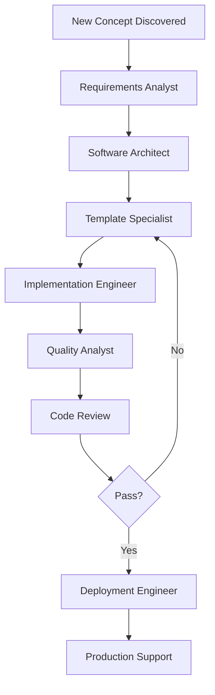

# AI Workflow Automation

## Overview

This documentation describes the recommended agentic AI workflow for maintaining and evolving the Scaffolding Templates repository. The approach is based on the "Ralph is a loop" concept from [AI Hero's guide to AI coding](https://www.aihero.dev/tips-for-ai-coding-with-ralph-wiggum#1-ralph-is-a-loop), which emphasizes continuous, automated AI-driven improvement cycles.

## Philosophy: Ralph is a Loop

The "Ralph is a loop" concept recognizes that AI agents work best in iterative cycles:

1. **Plan Mode First**: Always start with planning before implementation
2. **Automated Loops**: Set up continuous cycles for maintenance, discovery, and improvement
3. **Proactive Analysis**: AI agents should actively look for opportunities, not just respond to issues
4. **Feedback Integration**: Incorporate results from each cycle into the next iteration

## AI Workflow Architecture

### Core Principles

1. **Plan Before Execute**: Every task begins with a planning phase
2. **Automated Discovery**: AI proactively identifies issues and opportunities
3. **Continuous Improvement**: Regular automated cycles for maintenance
4. **Agent Specialization**: Different agents for different lifecycle phases

### Three Primary Workflows

#### 1. Automated Code Review & Tagging
**Purpose**: Automatically review changes and tag appropriate agents

**Trigger**: On pull request creation or updates

**Process**:
1. Analyze changed files to determine affected templates
2. Tag relevant template specialist agents
3. Tag appropriate SDLC phase agents (quality analyst, architect, etc.)
4. Generate initial code review using quality standards
5. Post review comments and tag agents for follow-up

**Benefits**:
- Ensures consistent code review
- Routes work to appropriate specialists
- Catches issues early in development

#### 2. Proactive Concept Discovery
**Purpose**: Identify new technologies, patterns, and best practices for templates

**Trigger**: Scheduled (weekly)

**Process**:
1. Scan ecosystem for new framework releases
2. Analyze community trends and best practices
3. Review related repositories for new patterns
4. Compare current templates against latest practices
5. Generate GitHub issues for promising concepts
6. Tag software architect and template specialists

**Benefits**:
- Keeps templates current with ecosystem
- Proactively identifies improvement opportunities
- Maintains competitive advantage

#### 3. Test Coverage Gap Analysis
**Purpose**: Identify and create issues for missing test coverage

**Trigger**: Scheduled (weekly)

**Process**:
1. Analyze unit test coverage across all templates
2. Identify uncovered code paths and edge cases
3. Check integration test coverage for key user flows
4. Identify missing end-to-end test scenarios
5. Generate GitHub issues for coverage gaps
6. Tag quality analyst agent for follow-up

**Benefits**:
- Maintains high code quality
- Ensures comprehensive test coverage
- Reduces production bugs

## Implementation Guide

### Setting Up Automated Workflows

All three workflows are implemented as GitHub Actions in `.github/workflows/`:

1. `ai-code-review.yml` - Automated code review on PRs
2. `ai-concept-discovery.yml` - Weekly concept discovery
3. `ai-test-coverage.yml` - Weekly test coverage analysis

### Configuration

Each workflow can be configured through environment variables and workflow inputs:

```yaml
env:
  MIN_COVERAGE_THRESHOLD: 80
  SCAN_FREQUENCY: weekly
  AGENT_AUTO_TAG: true
```

### Required Secrets

The workflows require the following GitHub secrets:

- `GITHUB_TOKEN` - For creating issues and comments (automatically provided)
- `OPENAI_API_KEY` - For AI analysis (optional, uses GitHub Copilot by default)

## Using the Workflows

### For Maintainers

#### Enabling Workflows

1. Workflows are enabled by default when merged to main
2. Configure workflow permissions in repository settings
3. Set required secrets if using external AI services

#### Reviewing AI-Generated Issues

When AI agents create issues:

1. Review the issue description and context
2. Validate the AI's analysis
3. Add additional context or requirements
4. Assign to appropriate team member or agent
5. Label appropriately (enhancement, bug, documentation)

#### Customizing Behavior

Modify workflow files to adjust:
- Scan frequency (cron schedule)
- Coverage thresholds
- Which agents to tag
- Issue templates and labels

### For Contributors

#### Working with AI-Generated Reviews

When a PR receives automated reviews:

1. Read through AI-generated comments carefully
2. Address legitimate concerns
3. Reply to comments that seem incorrect
4. Request human review if needed
5. Tag specific agents for specialized feedback

#### Responding to AI-Generated Issues

When assigned an AI-generated issue:

1. Validate the issue is legitimate
2. Use the tagged agent for implementation guidance
3. Follow the plan mode approach (plan first, then implement)
4. Reference the issue in your PR

## Agent Interaction Patterns

### Plan Mode Workflow

Always start tasks in "plan mode":

1. **Analyze Requirements**: Use requirements analyst agent
2. **Create Design**: Use software architect agent
3. **Plan Implementation**: Break down into small tasks
4. **Execute**: Use implementation or specialist agents
5. **Validate**: Use quality analyst agent
6. **Review**: Iterate based on feedback

### Agent Orchestration Example



### Agent Tagging Strategy

Different scenarios require different agent combinations:

**New Feature**:
- Requirements Analyst
- Software Architect
- Template Specialist
- Implementation Engineer
- Quality Analyst

**Bug Fix**:
- Maintenance Engineer
- Template Specialist (if template-specific)
- Quality Analyst

**Performance Optimization**:
- Deployment Engineer
- Template Specialist
- Production Support Engineer

**Test Coverage Improvement**:
- Quality Analyst
- Template Specialist (for framework-specific test patterns)

## Workflow Scripts

Supporting scripts are located in `/scripts/ai-workflows/`:

### Available Scripts

1. **analyze-templates.js**
   - Analyzes all templates for consistency
   - Identifies drift between templates
   - Suggests standardization opportunities

2. **check-test-coverage.js**
   - Generates coverage reports for all templates
   - Identifies coverage gaps
   - Creates issues for missing tests

3. **discover-concepts.js**
   - Scans ecosystem for new concepts
   - Analyzes community trends
   - Generates concept proposals

4. **tag-agents.js**
   - Determines appropriate agents for issues/PRs
   - Auto-tags relevant agents
   - Generates agent-specific context

## Best Practices

### Do's

- ✅ Always start in plan mode before implementing
- ✅ Use specialized agents for their domain expertise
- ✅ Review AI-generated content before acting on it
- ✅ Provide context when tagging agents
- ✅ Iterate based on feedback
- ✅ Document decisions and rationale

### Don'ts

- ❌ Don't skip the planning phase
- ❌ Don't ignore AI-generated suggestions without consideration
- ❌ Don't use generic agents when specialists are available
- ❌ Don't implement without proper validation
- ❌ Don't merge without code review
- ❌ Don't bypass quality checks

## Monitoring and Metrics

### Key Metrics to Track

1. **Code Quality**
   - Test coverage percentage
   - Linting issues per PR
   - Code review turnaround time

2. **AI Effectiveness**
   - AI-generated issues opened
   - AI-generated issues closed
   - AI suggestion acceptance rate

3. **Template Health**
   - Consistency across templates
   - Dependency freshness
   - Documentation completeness

### Dashboards

View metrics in GitHub Insights:
- Issues by label (ai-generated, coverage-gap, concept-proposal)
- PR metrics with AI review tags
- Workflow execution history

## Troubleshooting

### Common Issues

#### Workflow Not Triggering

1. Check workflow permissions in repository settings
2. Verify cron schedule syntax
3. Check GitHub Actions usage limits

#### AI-Generated Issues Are Low Quality

1. Review and adjust prompts in workflow files
2. Increase context window in agent configuration
3. Add more specific examples to prompts

#### Agent Tags Not Working

1. Verify agent files exist in `/agents/` directory
2. Check agent name formatting in tag script
3. Ensure GitHub Actions has permission to create comments

### Getting Help

1. Check [GitHub Actions documentation](https://docs.github.com/en/actions)
2. Review [GitHub Copilot Agents documentation](https://docs.github.com/en/copilot/using-github-copilot/using-agents)
3. Open an issue with the `workflow-automation` label
4. Tag `@seanmcquaid` for maintainer support

## Future Enhancements

### Planned Improvements

1. **Enhanced Analytics**
   - ML-based pattern detection
   - Trend analysis across templates
   - Predictive maintenance alerts

2. **Expanded Automation**
   - Automated dependency updates with compatibility testing
   - Automated documentation generation
   - Automated performance regression detection

3. **Integration Improvements**
   - Integration with project management tools
   - Slack/Discord notifications for AI-generated items
   - Dashboard for AI workflow metrics

### Contributing Ideas

We welcome ideas for improving AI workflows:

1. Open an issue with tag `ai-workflow-enhancement`
2. Describe the problem or opportunity
3. Propose a solution approach
4. Include examples if applicable

## References

- [AI Hero: Tips for AI Coding with Ralph Wiggum](https://www.aihero.dev/tips-for-ai-coding-with-ralph-wiggum#1-ralph-is-a-loop)
- [GitHub Copilot Custom Agents](https://docs.github.com/en/copilot/how-tos/use-copilot-agents/coding-agent/create-custom-agents)
- [GitHub Actions Documentation](https://docs.github.com/en/actions)
- Repository `/AGENTS.md` - Custom agents documentation
- Repository `/agents/README.md` - Agent usage guide
